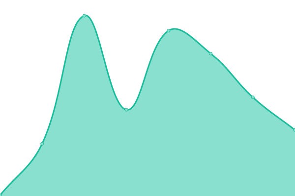
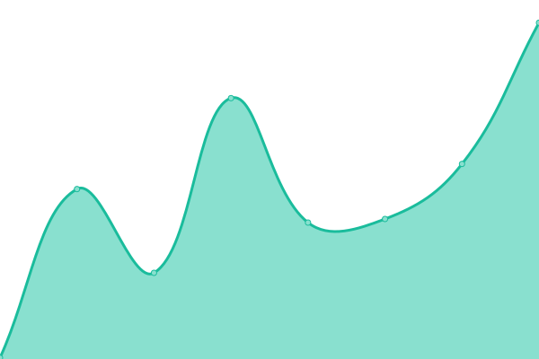
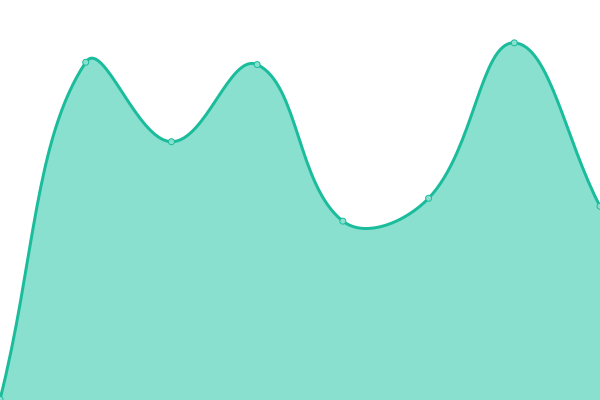
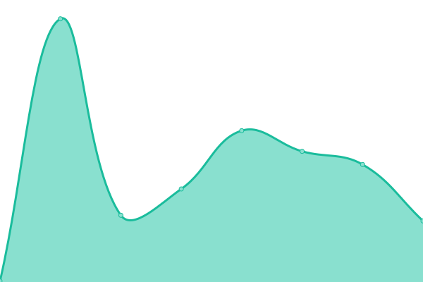
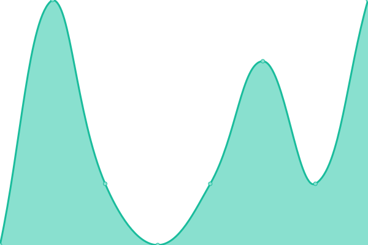

# [📈 Live Status](https://Zaid-maker.github.io/status-page-advanced): <!--live status--> **🟧 Partial outage**

This repository contains the open-source uptime monitor and status page for [DevMirza](https://www.devmirza.ml), powered by [Upptime](https://github.com/upptime/upptime).

With [Upptime](https://upptime.js.org), you can get your own unlimited and free uptime monitor and status page, powered entirely by a GitHub repository. We use [Issues](https://github.com/Zaid-maker/status-page-advanced/issues) as incident reports, [Actions](https://github.com/Zaid-maker/status-page-advanced/actions) as uptime monitors, and [Pages](https://Zaid-maker.github.io/status-page-advanced) for the status page.

<!--start: status pages-->
<!-- This summary is generated by Upptime (https://github.com/upptime/upptime) -->
<!-- Do not edit this manually, your changes will be overwritten -->
<!-- prettier-ignore -->
| URL | Status | History | Response Time | Uptime |
| --- | ------ | ------- | ------------- | ------ |
|  [Vercel](https://vercel.com) | 🟩 Up | [vercel.yml](https://github.com/Zaid-maker/status-page-advanced/commits/HEAD/history/vercel.yml) | 

 194ms
     
 | 

<a href="https://Zaid-maker.github.io/status-page-advanced/history/vercel">100.00%</a>
    

|  [Next.js](https://nextjs.org) | 🟩 Up | [next-js.yml](https://github.com/Zaid-maker/status-page-advanced/commits/HEAD/history/next-js.yml) | 

 167ms
     
 | 

<a href="https://Zaid-maker.github.io/status-page-advanced/history/next-js">100.00%</a>
    

|  [Turbo](https://turbo.build) | 🟩 Up | [turbo.yml](https://github.com/Zaid-maker/status-page-advanced/commits/HEAD/history/turbo.yml) | 

 617ms
     
 | 

<a href="https://Zaid-maker.github.io/status-page-advanced/history/turbo">100.00%</a>
    

|  [AI 3D API](https://rose-sleepy-elk.cyclic.app) | 🟥 Down | [ai-3-d-api.yml](https://github.com/Zaid-maker/status-page-advanced/commits/HEAD/history/ai-3-d-api.yml) | 

 0ms
     
 | 

<a href="https://Zaid-maker.github.io/status-page-advanced/history/ai-3-d-api">0.00%</a>
    

|  [Black Fort Hosting](https://blackforthosting.com) | 🟩 Up | [black-fort-hosting.yml](https://github.com/Zaid-maker/status-page-advanced/commits/HEAD/history/black-fort-hosting.yml) | 

 508ms
     
 | 

<a href="https://Zaid-maker.github.io/status-page-advanced/history/black-fort-hosting">100.00%</a>
    

|  [Discord Bot List](https://rough-freckle-ball.glitch.me/) | 🟥 Down | [discord-bot-list.yml](https://github.com/Zaid-maker/status-page-advanced/commits/HEAD/history/discord-bot-list.yml) | 

 167ms
     
 | 

<a href="https://Zaid-maker.github.io/status-page-advanced/history/discord-bot-list">0.00%</a>
    

|  [Google DNS 1](8.8.4.4) | 🟩 Up | [google-dns-1.yml](https://github.com/Zaid-maker/status-page-advanced/commits/HEAD/history/google-dns-1.yml) | 

 4ms
     
 | 

<a href="https://Zaid-maker.github.io/status-page-advanced/history/google-dns-1">100.00%</a>
    

|  [Google DNS 2](8.8.8.8) | 🟩 Up | [google-dns-2.yml](https://github.com/Zaid-maker/status-page-advanced/commits/HEAD/history/google-dns-2.yml) | 

 5ms
     
 | 

<a href="https://Zaid-maker.github.io/status-page-advanced/history/google-dns-2">100.00%</a>
    

<!--end: status pages-->

[**Visit our status website →**](https://Zaid-maker.github.io/status-page-advanced)

## 📄 License

- Powered by: [Upptime](https://github.com/upptime/upptime)
- Code: [MIT](./LICENSE) © [DevMirza](https://www.devmirza.ml)
- Data in the `./history` directory: [Open Database License](https://opendatacommons.org/licenses/odbl/1-0/)
