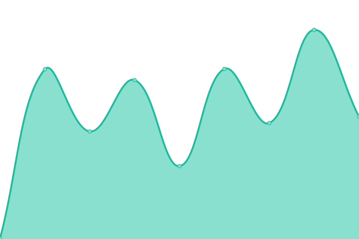

# [📈 Live Status](https://Zaid-maker.github.io/status-page-advanced): <!--live status--> **🟩 All systems operational**

This repository contains the open-source uptime monitor and status page for [DevMirza](https://www.devmirza.ml), powered by [Upptime](https://github.com/upptime/upptime).

With [Upptime](https://upptime.js.org), you can get your own unlimited and free uptime monitor and status page, powered entirely by a GitHub repository. We use [Issues](https://github.com/Zaid-maker/status-page-advanced/issues) as incident reports, [Actions](https://github.com/Zaid-maker/status-page-advanced/actions) as uptime monitors, and [Pages](https://Zaid-maker.github.io/status-page-advanced) for the status page.

<!--start: status pages-->
<!-- This summary is generated by Upptime (https://github.com/upptime/upptime) -->
<!-- Do not edit this manually, your changes will be overwritten -->
<!-- prettier-ignore -->
| URL | Status | History | Response Time | Uptime |
| --- | ------ | ------- | ------------- | ------ |
|  [DevMirza Official Website](https://www.devmirza.ml) | 🟩 Up | [dev-mirza-official-website.yml](https://github.com/Zaid-maker/status-page-advanced/commits/HEAD/history/dev-mirza-official-website.yml) | 

 311ms
     
 | 

<a href="https://status.devmirza.ml/history/dev-mirza-official-website">100.00%</a>
    

|  [DevMirza Blog](https://blog.devmirza.ml) | 🟩 Up | [dev-mirza-blog.yml](https://github.com/Zaid-maker/status-page-advanced/commits/HEAD/history/dev-mirza-blog.yml) | 

 4541ms
     
 | 

<a href="https://status.devmirza.ml/history/dev-mirza-blog">100.00%</a>
    

|  [DevMirza Blog Backend](https://waggish-tangible-airport.strapiapp.com) | 🟩 Up | [dev-mirza-blog-backend.yml](https://github.com/Zaid-maker/status-page-advanced/commits/HEAD/history/dev-mirza-blog-backend.yml) | 

 657ms
     
 | 

<a href="https://status.devmirza.ml/history/dev-mirza-blog-backend">100.00%</a>
    

|  [Code Server (domain not working)](http://n3.danbot.host:1146) | 🟩 Up | [code-server-domain-not-working.yml](https://github.com/Zaid-maker/status-page-advanced/commits/HEAD/history/code-server-domain-not-working.yml) | 

 1477ms
     
 | 

<a href="https://status.devmirza.ml/history/code-server-domain-not-working">98.88%</a>
    

|  [Chat Bot API](https://api.devmirza.ml) | 🟩 Up | [chat-bot-api.yml](https://github.com/Zaid-maker/status-page-advanced/commits/HEAD/history/chat-bot-api.yml) | 

 330ms
     
 | 

<a href="https://status.devmirza.ml/history/chat-bot-api">100.00%</a>
    

|  [Black Fort Hosting](https://panel.blackforthosting.com) | 🟩 Up | [black-fort-hosting.yml](https://github.com/Zaid-maker/status-page-advanced/commits/HEAD/history/black-fort-hosting.yml) | 

 497ms
     
 | 

<a href="https://status.devmirza.ml/history/black-fort-hosting">100.00%</a>
    

|  [Cyclone Bot List (domain not working)](http://n2.danbot.host:2427) | 🟩 Up | [cyclone-bot-list-domain-not-working.yml](https://github.com/Zaid-maker/status-page-advanced/commits/HEAD/history/cyclone-bot-list-domain-not-working.yml) | 

 1830ms
     
 | 

<a href="https://status.devmirza.ml/history/cyclone-bot-list-domain-not-working">98.88%</a>
    

|  [Codex AI](https://codex.devmirza.ml) | 🟩 Up | [codex-ai.yml](https://github.com/Zaid-maker/status-page-advanced/commits/HEAD/history/codex-ai.yml) | 

 954ms
     
 | 

<a href="https://status.devmirza.ml/history/codex-ai">100.00%</a>
    

<!--end: status pages-->

[**Visit our status website →**](https://Zaid-maker.github.io/status-page-advanced)

## 📄 License

- Powered by: [Upptime](https://github.com/upptime/upptime)
- Code: [MIT](./LICENSE) © [DevMirza](https://www.devmirza.ml)
- Data in the `./history` directory: [Open Database License](https://opendatacommons.org/licenses/odbl/1-0/)
